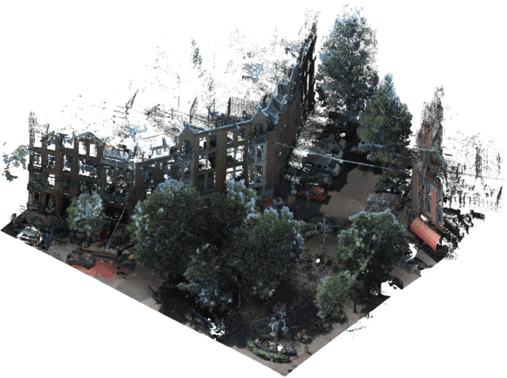

# Urban Point Cloud Suspended Streetlight and Cable Extraction

This repository contains methods for the **automatic detection and extraction of Urban PointClouds**. The methods can serve as inspiration, or can be applied as-is under some specific assumptions:

1. Usage in The Netherlands (The "[Rijksdriehoek coordinate system](https://nl.wikipedia.org/wiki/Rijksdriehoeksco%C3%B6rdinaten)");
2. Point clouds in LAS format and tiled following [specific rules](datasets); and
3. Fusion with [AHN](https://www.ahn.nl/), [BAG](https://www.geobasisregistraties.nl/basisregistraties/adressen-en-gebouwen), and [BGT](https://www.geobasisregistraties.nl/basisregistraties/grootschalige-topografie) public data sources.

Example [notebooks](notebooks) are provided to demonstrate the tools.

<figure align="center">
  
  <figcaption><b>Example:</b> automatic detection of suspended streetlights, and cables.</figcaption>
</figure>

---

## Project Goal

The goal of this project is to automatically detect and extract suspended streetlights and cables in street level point clouds. A typical approach would be to build and train a machine learning classier, but this requires a rich labeled dataset to train on. One of the main challenges in working with 3D point cloud data is that, in contrast to 2D computer vision, _no general-purpose training sets are available_. Moreover, the sparsity and non-uniform density of typical point clouds makes transferring results form one task to another difficult.

This repository contains a four-staged pipeline that combine public datasets such as elevation data, building footprints, to reduce the search space and detect suspended streetlights and cables.

For a quick dive into this repository take a look at our [complete solution notebook](notebooks/Complete%20solution.ipynb).

---

## Folder Structure

 * [`demo_dataset`](./demo_datasets) _Demo dataset to get started_
   * [`ahn`](./demo_datasets/ahn) _AHN data_
   * [`bag`](./demo_datasets/bag) _BAG data_
   * [`bgt`](./demo_datasets/bgt) _BGT data_
   * [`pointcloud`](./demo_datasets/pointcloud) _Example urban point cloud_
 * [`notebooks`](./notebooks) _Jupyter notebook tutorials_
 * [`src`](./src) _Python source code_
   * [`stages`](./src/stages) _Stage code_
   * [`preprocessing`](./src/preprocessing) _Pre-processing code_
   * [`scrapers`](./src/scrapers) _Data scrapers_
   * [`utils`](./src/utils) _Utility functions_

---

## Installation

1. Clone this repository:
    ```bash
    git clone https://github.com/Amsterdam-Internships/UPC_Suspended_Streetlight_Extractor.git
    ```

2. Install all dependencies (requires Python >=3.8):
    ```bash
    pip install -r requirements.txt
    ```
    Additionally, install `cccorelib` and `pycc` by following the [instructions on their GitHub page](https://github.com/tmontaigu/CloudCompare-PythonPlugin/blob/master/docs/building.rst#building-as-indenpendent-wheels).
    Optionally install JupyterLab to use the notebooks `python -m pip install jupyterlab ipympl ipywidgets`

3. Check out the [notebooks](notebooks) for a demonstration.

---

## Usage

We provide tutorial [notebooks](notebooks) that demonstrate how the tools can be used.

For visualisation of the resulting labelled point clouds we suggest [CloudCompare](https://www.danielgm.net/cc/). Simply open the labelled .laz in CloudCompare, select the cloud, and set `Colors` to the custom `Scalar Field` named `label`. For best results, use our [custom "AMS" color scale](https://github.com/Amsterdam-AI-Team/Urban_PointCloud_Processing/raw/main/media/cc_color_scale.xml), and set "steps" to 101.

---

## Acknowledgements

This repository was created by _Falke Boskaljon_ for the City of Amsterdam.
